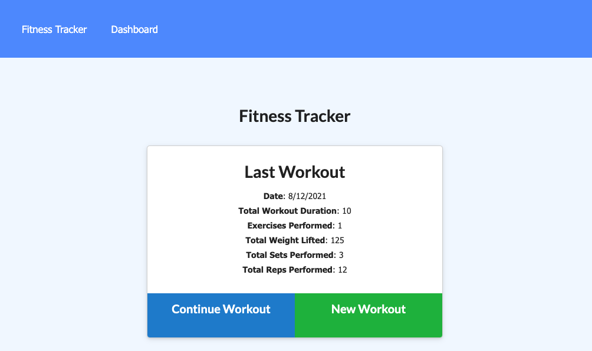
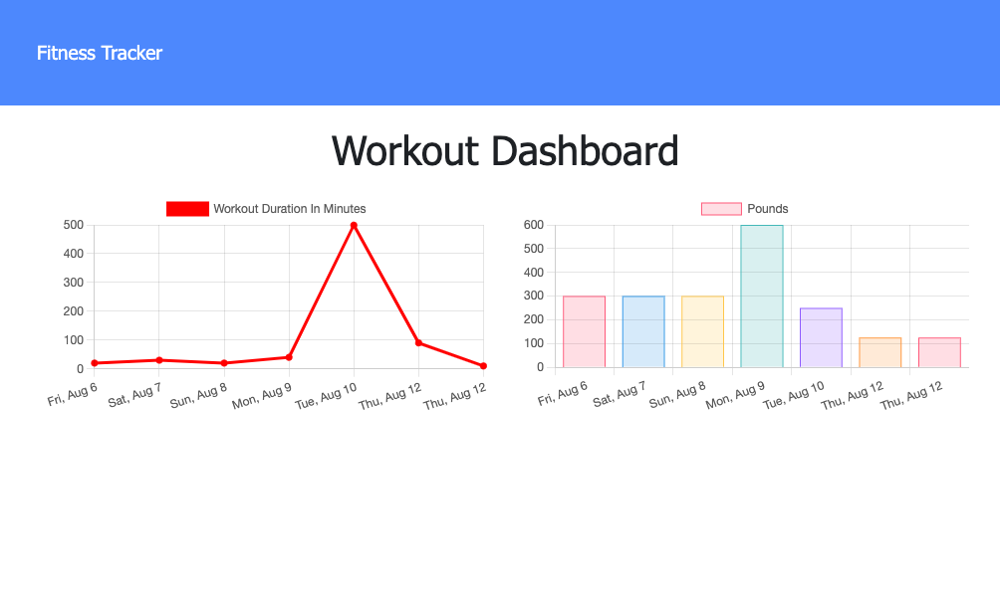

# Fitness Tracker
## Description

This app was created to learn how to work with MongoDB and Mongoose.  This app is a fitness tracker that allows the user to enter a new workout (or continue the current one) and add exercises of two types: Resitance or Cardio. The App also provides a dashboard that shows the duration in minutes of the last seven workouts and the weight totals for the last seven workouts.  I learned how to set up Models using Mongoose and how to use the aggregrate function to sum the durations of each exercise into a totalDuration field.

## Table of Contents
- [Installation](#installation)
- [Usage](#usage)
- [Credits](#credits)
- [Questions](#questions)
- [License](#license)

## Installation
The app is setup to run on Heroku.  If someone wants to setup the app for their own use, they can clone the repo in github and then connect it to a Heroku app that they have setup.  They will also need to setup a Mongo Atlas database and set the connection string from Atlas to a environment variable on Heroku named MONGODB_URI.
## Usage
A user could use the project to track their exercise.  A programmer could use the project to study an example of using Mongoose and setting up aggregation calls.  I would recommend using Compass to build the aggregation string.
## Credits
This app uses the following libraries and modules: Express, Mongoose, and Express.Router.  While developing, I also made use Compass for viewing the database.  For deployment, the project makes use of Heroku to serve the app and Atlas to host the database.
## Questions
If you have any questions you can contact the author through his github user profile: https://github.com/bdstpierre
or by sending an email to barry@stpierre.com
## License
Copyright 2021 Barry St. Pierre

    Permission is hereby granted, free of charge, to any person obtaining a copy of this software and associated documentation files (the "Software"), to deal in the Software without restriction, including without limitation the rights to use, copy, modify, merge, publish, distribute, sublicense, and/or sell copies of the Software, and to permit persons to whom the Software is furnished to do so, subject to the following conditions:
    
    The above copyright notice and this permission notice shall be included in all copies or substantial portions of the Software.
    
    THE SOFTWARE IS PROVIDED "AS IS", WITHOUT WARRANTY OF ANY KIND, EXPRESS OR IMPLIED, INCLUDING BUT NOT LIMITED TO THE WARRANTIES OF MERCHANTABILITY, FITNESS FOR A PARTICULAR PURPOSE AND NONINFRINGEMENT. IN NO EVENT SHALL THE AUTHORS OR COPYRIGHT HOLDERS BE LIABLE FOR ANY CLAIM, DAMAGES OR OTHER LIABILITY, WHETHER IN AN ACTION OF CONTRACT, TORT OR OTHERWISE, ARISING FROM, OUT OF OR IN CONNECTION WITH THE SOFTWARE OR THE USE OR OTHER DEALINGS IN THE SOFTWARE.

